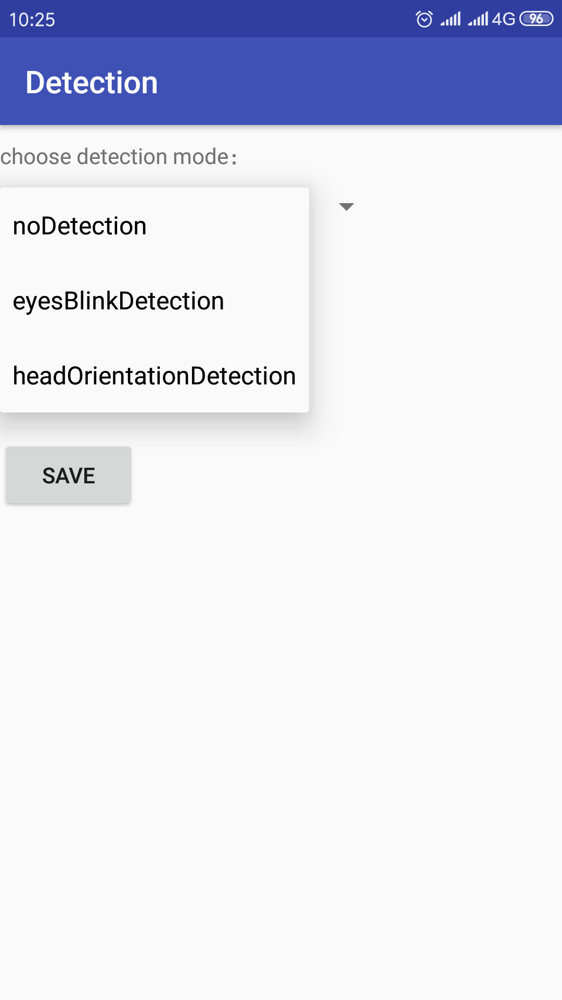
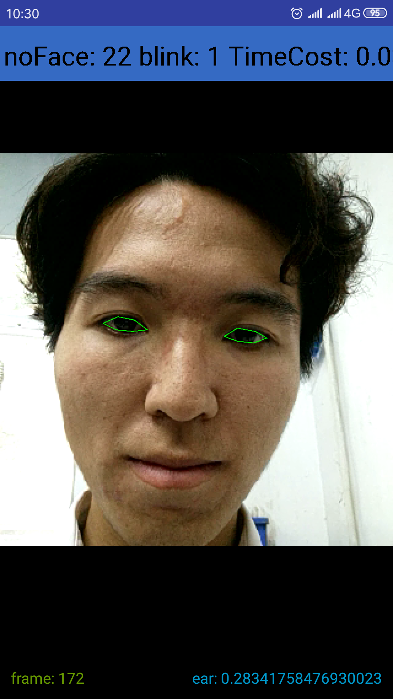
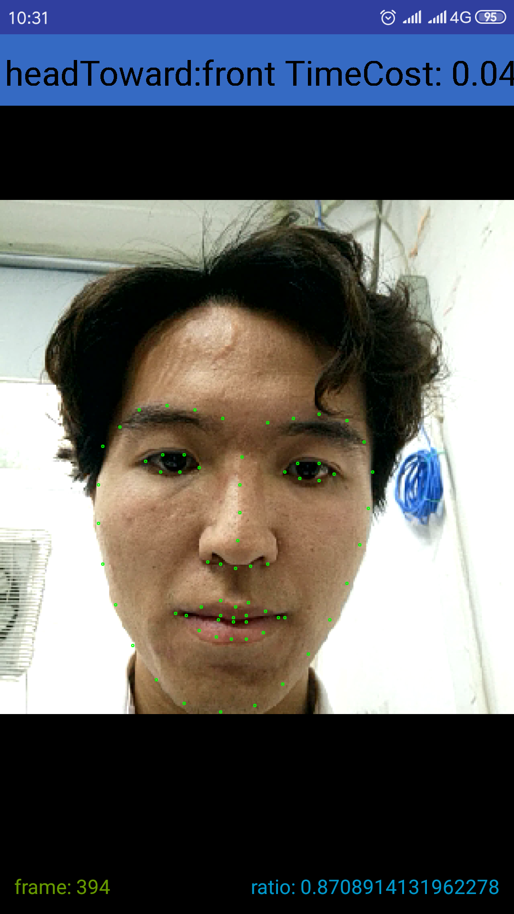
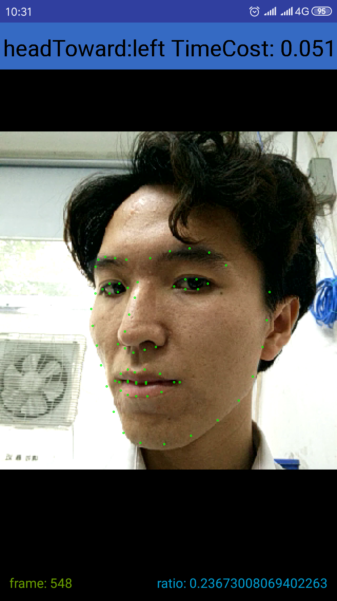

# Introduction

detectionWithDlib is an android application which can detect your blinking movements and head orientation. It's based on [fast-face-android
](https://github.com/gicheonkang/fast-face-android),which make an upgraded from [dlib-android](https://github.com/tzutalin/dlib-android), fast-face-android using facing front camera instead and speeds up 2x or more from the original. 

before you start the detection, there are 3 option for you to choose, see from the screenshot below. 

## eyes blink detection

I have implemented blink detection on Python before, so I just ported it to Android. 

blink detection needs to process data of every frame, [AndroidCamera-ProcessFrames
](https://github.com/zhantong/AndroidCamera-ProcessFrames) provides some ways to process frame without frame-loss, I use one of them.

### Screenshot

 

## head orientation detection

it's easy to judge the orientation of a head with the help of Dlib's 68 face landmark

### Sreenshot
     
